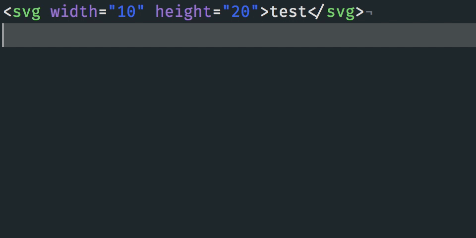

# [atom-svgo](https://atom.io/packages/svgo)

Minify SVG with [SVGO](http://github.com/svg/svgo).

[](https://travis-ci.org/1000ch/atom-svgo)
[](https://ci.appveyor.com/project/1000ch/atom-svgo)
[](https://circleci.com/gh/1000ch/atom-svgo)
[](https://david-dm.org/1000ch/atom-svgo)
[](https://david-dm.org/1000ch/atom-svgo?type=dev)



## Install

```bash
$ apm install svgo
```

## Usage

- Packages > SVGO > **Minify SVG** or **Prettify SVG**
- Context Menu > **Minify SVG** or **Prettify SVG**
- Command Palette (<kbd>⌘</kbd> + <kbd>shift</kbd> + <kbd>P</kbd>) > **Minify SVG** or **Prettify SVG**

## Config

### Indent

Indent size to apply on prettify.

### Disable

[Plugin names](https://github.com/svg/svgo#what-it-can-do) (separated with space delimiter) to disable.

## License

[MIT](https://1000ch.mit-license.org) © [Shogo Sensui](https://github.com/1000ch)
